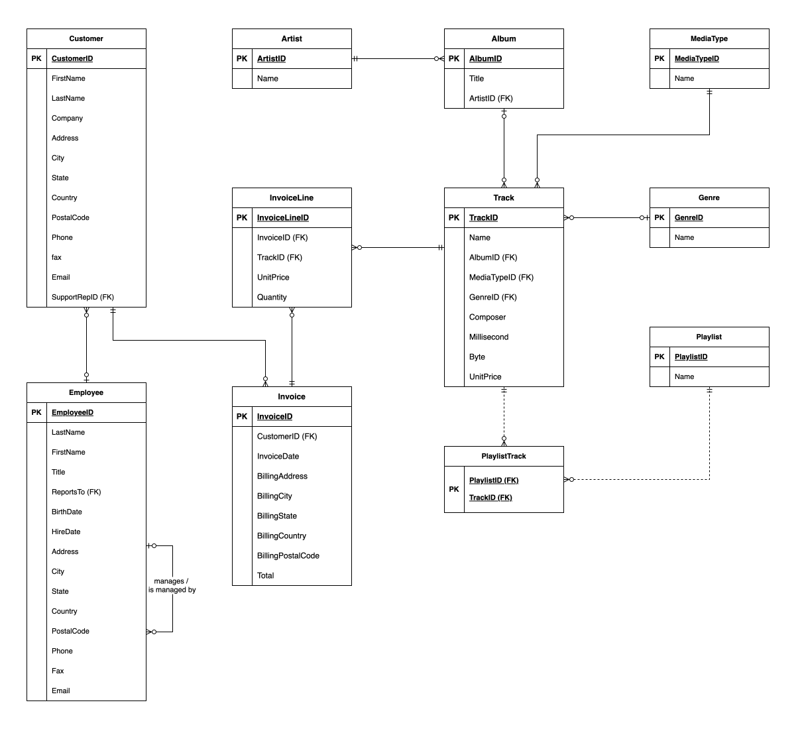

# 💼 Case study
### Chinook
[©](https://creativecommons.org/licenses/by/4.0/) [Johnny Chan](mailto:jh.chan@auckland.ac.nz) | 🗓 2025-07-11


## Background
- [Chinook](https://github.com/lerocha/chinook-database) is a sample database being commonly used for demos and testing purposes on multiple products including SQLite. It is an open source project

- The database can be (re)created by running a single [SQL script](chinook.sql)
```
sqlite> .read chinook.sql
```

- The company Chinook runs a business of selling tracks and albums of music and video online. The database manages all the transactions, and all relevant information related to the products and customers


## Specification
- The following specification captures the Chinook database schema through all the CREATE TABLE statements that build up the database:

  - Album
  - Artist
  - Customer
  - Employee
  - Genre
  - Invoice
  - InvoiceLine
  - MediaType
  - PlayList
  - PlayListTrack
  - Track


## Album
```
CREATE TABLE Album
(
    AlbumID INTEGER PRIMARY KEY NOT NULL,
    Title TEXT NOT NULL,
    ArtistID INTEGER NOT NULL,
    FOREIGN KEY (ArtistID) REFERENCES Artist (ArtistID)
		ON DELETE NO ACTION ON UPDATE NO ACTION
);
```


## Artist
```
CREATE TABLE Artist
(
    ArtistID INTEGER PRIMARY KEY NOT NULL,
    Name TEXT
);
```


## Customer
```
CREATE TABLE Customer
(
    CustomerID INTEGER PRIMARY KEY NOT NULL,
    FirstName TEXT NOT NULL,
    LastName TEXT NOT NULL,
    Company TEXT,
    Address TEXT,
    City TEXT,
    State TEXT,
    Country TEXT,
    PostalCode TEXT,
    Phone TEXT,
    Fax TEXT,
    Email TEXT NOT NULL,
    SupportRepID INTEGER,
    FOREIGN KEY (SupportRepID) REFERENCES Employee (EmployeeID)
		ON DELETE NO ACTION ON UPDATE NO ACTION
);
```
<!-- .element: style="font-size:85%" -->


## Employee
```
CREATE TABLE Employee
(
    EmployeeID INTEGER PRIMARY KEY NOT NULL,
    LastName TEXT NOT NULL,
    FirstName TEXT NOT NULL,
    Title TEXT,
    ReportsTo INTEGER,
    BirthDate DATE,
    HireDate DATE,
    Address TEXT,
    City TEXT,
    State TEXT,
    Country TEXT,
    PostalCode TEXT,
    Phone TEXT,
    Fax TEXT,
    Email TEXT,
    FOREIGN KEY (ReportsTo) REFERENCES Employee (EmployeeID)
		ON DELETE NO ACTION ON UPDATE NO ACTION
);
```
<!-- .element: style="font-size:75%" -->


## Genre
```
CREATE TABLE Genre
(
    GenreID INTEGER PRIMARY KEY NOT NULL,
    Name TEXT
);
```


## Invoice
```
CREATE TABLE Invoice
(
    InvoiceID INTEGER PRIMARY KEY NOT NULL,
    CustomerID INTEGER NOT NULL,
    InvoiceDate DATE NOT NULL,
    BillingAddress TEXT,
    BillingCity TEXT,
    BillingState TEXT,
    BillingCountry TEXT,
    BillingPostalCode TEXT,
    Total REAL NOT NULL,
    FOREIGN KEY (CustomerID) REFERENCES Customer (CustomerID)
		ON DELETE NO ACTION ON UPDATE NO ACTION
);
```
<!-- .element: style="font-size:95%" -->


## InvoiceLine
```
CREATE TABLE InvoiceLine
(
    InvoiceLineID INTEGER PRIMARY KEY NOT NULL,
    InvoiceID INTEGER NOT NULL,
    TrackID INTEGER NOT NULL,
    UnitPrice REAL NOT NULL,
    Quantity INTEGER NOT NULL,
    FOREIGN KEY (InvoiceID) REFERENCES Invoice (InvoiceID)
		ON DELETE NO ACTION ON UPDATE NO ACTION,
    FOREIGN KEY (TrackID) REFERENCES Track (TrackID)
		ON DELETE NO ACTION ON UPDATE NO ACTION
);
```


## MediaType
```
CREATE TABLE MediaType
(
    MediaTypeID INTEGER PRIMARY KEY NOT NULL,
    Name TEXT
);
```


## PlayList
```
CREATE TABLE Playlist
(
    PlaylistID INTEGER PRIMARY KEY NOT NULL,
    Name TEXT
);
```


## PlayListTrack
```
CREATE TABLE PlaylistTrack
(
    PlaylistID INTEGER NOT NULL,
    TrackID INTEGER NOT NULL,
    PRIMARY KEY (PlaylistID, TrackID),
    FOREIGN KEY (PlaylistID) REFERENCES Playlist (PlaylistID)
		ON DELETE NO ACTION ON UPDATE NO ACTION,
    FOREIGN KEY (TrackID) REFERENCES Track (TrackID)
		ON DELETE NO ACTION ON UPDATE NO ACTION
);
```
<!-- .element: style="font-size:95%" -->


## Track
```
CREATE TABLE Track
(
    TrackID INTEGER PRIMARY KEY NOT NULL,
    Name TEXT NOT NULL,
    AlbumID INTEGER,
    MediaTypeID INTEGER NOT NULL,
    GenreID INTEGER,
    Composer TEXT,
    Millisecond INTEGER NOT NULL,
    Byte INTEGER,
    UnitPrice REAL NOT NULL,
    FOREIGN KEY (AlbumID) REFERENCES Album (AlbumID)
		ON DELETE NO ACTION ON UPDATE NO ACTION,
    FOREIGN KEY (GenreID) REFERENCES Genre (GenreID)
		ON DELETE NO ACTION ON UPDATE NO ACTION,
    FOREIGN KEY (MediaTypeID) REFERENCES MediaType (MediaTypeID)
		ON DELETE NO ACTION ON UPDATE NO ACTION
);
```
<!-- .element: style="font-size:85%" -->


## The logical ERD
<!-- .element: height="650px" -->


# 🌏 THE END
Don't forget Chinook is awesome!

[🖨](?print-pdf)
