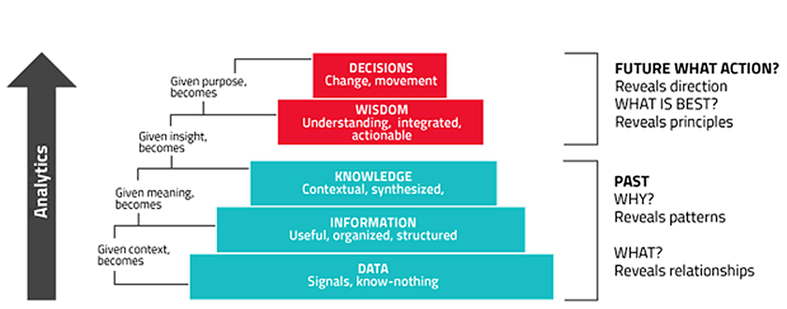
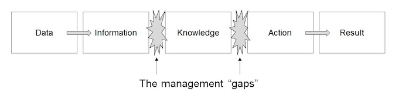
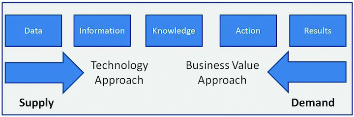

# 🗄 Week 01
### Introduction
[©](https://creativecommons.org/licenses/by/4.0/) [Johnny Chan](mailto:jh.chan@auckland.ac.nz)


## 📌 Agenda
- What is information management?

- What you would learn

- Overview of the course

- Course schedule


## What is information management
- Information management (IM) is the appropriate and optimised capture, storage, retrieval and use of information at a personal or organisational level

- IM for organisations concerns a cycle of activity: 1) the acquisition of information from one or more sources, 2) the custodianship and the distribution of that information to those who need it, and 3) its ultimate disposal through archiving or deletion

- It is closely related to, and overlaps with, the management of data, system, technology, process and where the availability of information is critical to organisational strategy and its success


## Common issues in IM
- __How__ information is acquired, recorded and stored
- __Where__ information resources are in the organisation and __who__ is responsible
- __How__ information flows within and between the organisation and outside
- __How__ the organisation uses the information
- __How__ people who handle it apply their skills and cooperate with one another
- __How__ information technology supports the users of information
- __What__ information costs and __what__ value does it contribute
- __How__ effectively all these information-related activities contribute towards the
achievement of the organisation’s objectives


## IM life cycle
- Identification
- Acquisition
- Organisation and storage
- Analysis and intrepretation
- Access and sharing
- Administration, retention and security


## The [DIKW model](https://www.nomos-elibrary.de/10.5771/0943-7444-2019-1-33.pdf)


<small>Figure 1.1: The DIKW model from [Mannion (2015)](https://electronics360.globalspec.com/article/4890/optimal-analysis-algorithms-are-iot-s-big-opportunity)</small>


## The [DIKAR model](https://www.researchgate.net/publication/357242513_Critical_Overview_of_Information_Management_DIKAR_Model_and_Technology_in_the_21st_Century)


<small>Figure 1.2: The DIKAR model from [Wikimedia Commons](https://commons.wikimedia.org/wiki/File:DIKAR_model.jpg)</small>



<small>Figure 1.3: The DIKAR model from [Daly (2020)](https://doi.org/10.1007/978-3-030-32922-8_30)</small>


## Data management
- Data is the new oil (Humby, 2006)
- After refinement (i.e. cleansing, validation, analysis and auditing), data could become useful information for business
- Data sovernigty and governance
- Structured data vs unstructured data
- Database and data warehouse

📚 Further: [The emerging data challenge and opportunity](https://www.oreilly.com/library/view/data-curious/9781098143824/ch01.html)


## Why study database?
- Because it is interesting! Database relates to a wide range of domains including information systems, computer science, engineering, mathematics, statistics, accounting, marketing and more

- Most software applications require a database

- [Data scientist](https://en.wikipedia.org/wiki/Data_science) uses database to handle large and distributed datasets

- The demand for database to host our ever growing data and information would only go up as complexity increases


## What you would learn
- By the end of the course, you would have gained a solid background in information management. Specifically:

	- demonstrate effective use of key data management software and tools
	- write queries using Structured Query Language [(SQL)](https://en.wikipedia.org/wiki/SQL) to extract data stored in relational databases and data warehouses
	- plan, design and execute the extract, load, transform [(ELT)](https://en.wikipedia.org/wiki/Extract,_load,_transform) data flows from transactional data stores to a data warehouse
	- show independent and reflect thinking, considering the [ethical](https://data.govt.nz/toolkit/data-ethics), regulatory, cultural and social contexts of data and business information management


## Overview of the course
- What is a database?

- What is a DBMS?

- What is a relational database?

- How to design a relational database?

- How to implement and use a relational database?

- SQLite and SQL


## What is a database?
- According to the [Oxford Dictionary](http://www.oxforddictionaries.com/definition/english/database):

	> A structured set of data held in a computer, especially one that is accessible in various ways

- 🤔 How is a database different from a file system?

- It is a collection of information that exists over a long period of time; the term database refers to a collection of data that is managed by a database management system (DBMS)


## What is a DBMS?
> It is a system for providing __efficient__, __convenient__, and __safe__ storage of and __multi-user__ access to (possibly __massive__) amounts of __persistent__ data

- 🤔 Think of five examples when each of the bolded words applies

- The DBMS [evolution](https://en.wikipedia.org/wiki/Database#History): hierarchical → network → relational → object-oriented → object-relational → NoSQL → NewSQL

- The [most popular DBMS in 2025](https://survey.stackoverflow.co/2025/technology#1-databases) based on the [developer survey](https://survey.stackoverflow.co/2025) from [Stack Overflow](https://stackoverflow.com)


## What is a relational database?
- All major general purpose DBMSs are based on the so-called [relational data model](https://en.wikipedia.org/wiki/Relational_model). It means that all data are stored in a number of named tables (with named columns and keys), such as the following table __Account__:

_accNo_ | balance | type
--- | --- | ---
11111 | 1234.50 | saving
22222 | 7654.32 | check
99999 | -8888.00 | loan

- For historical, mathematical reasons such table is referred to as a relation. This course focuses solely on [relational database](https://en.wikipedia.org/wiki/Relational_database) and relational data warehouse


## How to design a relational database?
- It is often far from obvious to decide how to store data from an application as relations. A small part of the course will deal with a methodology for good relational database design known as [entity-relationship (ER) modelling]((https://en.wikipedia.org/wiki/Entity%E2%80%93relationship_model))

- 🤔 Suggest how to represent the following types of data as one or more relations: 1) a contact list, 2) a shopping cart

- 🤔 Can you avoid (or reduce) duplication of data?


## How to implement and use a relational database?
- The success of relational database is largely due to the existence of powerful programming language for writing database queries

- The most important of such language is [structured query language (SQL)](https://en.wikipedia.org/wiki/SQL):
	- convenience: queries can be written with little effort
	- efficiency: even for large datasets, a good DBMS can answer queries written in SQL very quickly


# ▶️ Demo
### The [Northwind](nw.sql) database in [SQLite](https://sqlite.org/)


## SQLite
- [SQLite](https://sqlite.org/) is an open source cross-platform embedded relational DBMS. It is the [most deployed and used database, and the second most deployed software](https://www.sqlite.org/mostdeployed.html)
- It is lightweight and it can run in most computing device
- User interacts with SQLite via the [Terminal](https://support.apple.com/en-nz/guide/terminal/welcome/mac) / [Command Prompt](https://learn.microsoft.com/en-us/windows-server/administration/windows-commands/windows-commands), or a GUI like [DB Browser](https://sqlitebrowser.org/)
- [SQLite command](http://sqlite.org/cli.html) vs [SQL statement](http://sqlite.org/lang.html)
- A SQLite database file is commonly named with ```.db``` or ```.sqlite```
- A ```.sql``` file is known as a script file containing SQL statements
- 🤔 What is the major difference between SQLite and other RDBMS product?
- 📢 All SQL related content and assessment in this course are expected to be run with SQLite


## SQL

_accNo_ | balance | type
--- | --- | ---
11111 | 1234.50 | saving
22222 | 7654.32 | check
99999 | -8888.00 | loan

- Consider the relation __Account__, the SQL code to get the balance from accNo 22222:

```sql
SELECT balance
FROM Account
WHERE accNo = 22222;
```
<!-- .element: contenteditable="true" -->


## SQL: example

```sql
SELECT accNo, balance
FROM Account
WHERE type = 'loan'
AND balance < -10000;
```
<!-- .element: contenteditable="true" -->

```sql
SELECT *
FROM Account
WHERE accNo > balance;
```
<!-- .element: contenteditable="true" -->

- 📢 * stands for all columns in a table
- 📢 a pair of single quotes are needed for text and date literal


## SQL: more example

_accNo_ | _name_ | address
--- | --- | ---
11111 | Dexter Morgan | 666 Miami Road
22222 | Steven Roger | 222 Patriot Street
22222 | Peggy Carter | 999 Marvel Avenue
99999 | John Reese | 314 Machine Place

- Suppose we have a related relation __Holder__, the SQL code to get the names of holders with check accounts:

```sql
SELECT name
FROM Account, Holder
WHERE Account.accNo = Holder.accNo
AND Account.type = 'check';
```
<!-- .element: contenteditable="true" -->


## SQL: SELECT-FROM-WHERE
```sql
SELECT column1, column2, ...
FROM relation1
WHERE <conditions>;
```

```sql
SELECT column1, column2, ...
FROM relation1, relation2, ...
WHERE <join conditions>
AND <conditions>;
```


## SQL: Quiz
- Consider the relation [__Account__](#/7) again

	Write a SQL statement that lists all accounts (with accNo and type) that have a positive balance

```sql
SELECT ...
FROM ...
WHERE ...

```
<!-- .element: contenteditable="true" -->


## SQL: Syntax and semantics
- As demonstrated, SQL statement resembles asking question in English. Quite often, the effect of an SQL statement can be intuitively understood

- During the course you will learn how to compose much more complex statement in SQL. To do that you need a precise understanding of SQL’s:

	- Syntax: The way SQL statement could be written
	- Semantics: The meaning of a SQL statement


## SQL: More aspects
- SQL is based on a mathematical formalism called [relational algebra](https://en.wikipedia.org/wiki/Relational_algebra)

- In addition to queries, SQL can be used to express many types of database operations:
	- Define new relations
	- Perform changes to data (e.g. insert, update and delete)
	- Set up constraints and triggers
	- Manage users, permissions, etc
	- Control transactions in a multi-user environment


## 🗒 Summary
- By now you should:

	- know what this course is about

	- know how you could do well in this course

	- know a little about some key concepts: database, DBMS, relation, SQL; and know how they fit into the course

	- understand SELECT-FROM-WHERE of SQL


## 📝 To do
- Run [SQLite](https://sqlite.org/) with your own device successfully and recreate the [database](week01.sql) used in the lecture

- Be familiar with the SQLite commands: ```.tables, .schema, .mode, .read, .help, .quit```

- Attend the lab

- Accept the invitation to Datacamp from your aucklanduni email

- Explore the [Northwind database](nw.sql) and complete A1 before the deadline


## 📚 Reading
- Essential
	- [The Worlds of Database Systems (p1-9)](http://infolab.stanford.edu/~ullman/fcdb/ch1.pdf)
	- [Introduction from SQL for Web Nerds](http://philip.greenspun.com/sql/introduction.html)

- Further
	- [The Emerging Data Challenge and Opportunity](https://www.oreilly.com/library/view/data-curious/9781098143824/ch01.html)
	- [SQLite documentation on SQL](https://sqlite.org/lang.html)
	- [Database from Wikipedia](https://en.wikipedia.org/wiki/Database)


## 🗓 Schedule
Week | Lecture
--- | ---
01 | Introduction ✓
02 | SQL fundamentals
03 | Data modelling
04 | SQL aggregation & subquery
05 | Recap
06 | Test review
07 | Data warehouse
08 | Extract, load & transform
09 | Measure & hierarchy
10 | Course review


# 🌏 THE END
Don't forget information management is awesome!

[🖨](?print-pdf)
