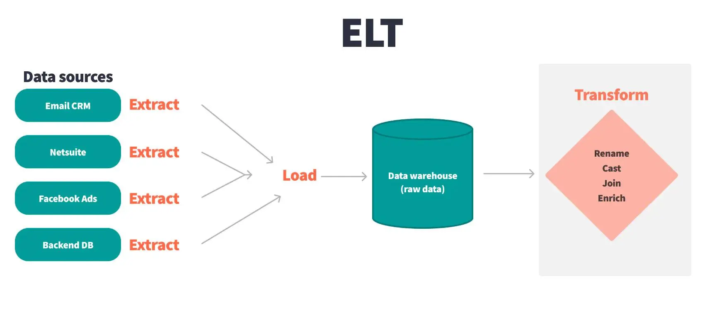

# 🗄️ Week 08
### Extract, load and transform
[©](https://creativecommons.org/licenses/by/4.0) [Johnny Chan](mailto:jh.chan@auckland.ac.nz)


## 🕒 Previously ...

- data warehouse

- star schema


## 📌 Agenda

- ELT and ETL

- ELT and SQLite


## What is ELT?
- Extract, load and transform [(ELT)](https://en.wikipedia.org/wiki/Extract,_load,_transform) is the process of combining data from multiple sources into a data warehouse. ELT uses a set of business rules to clean and organise raw data to prepare it for storage, analytics and machine learning. Specific business intelligence needs can be addressed through analytics (such as predicting the outcome of business decisions, generating reports and dashboards, reducing operational inefficiency etc)

- 🤔 Why is ELT important?

  - Organisations today have both structured and unstructured data from various sources; by applying ELT, individual raw datasets can be prepared in a format and structure that is more consumable for analytics purposes, resulting in more meaningful insight


## How does ELT work?
<!-- .element: height="300px" -->

- ELT works by moving data from the source system to the destination system at periodic intervals. The ELT process works in three steps:
  1. Extract the relevant data from the source
  2. Load the data into the target data repository
  3. Transform the data so that it is better suited for analytics or other purposes


## Data extraction
- In data extraction, the ELT tool extracts or copies raw data from multiple sources and prepares them for loading into the target data repository. The target data repository could have a staging area that is an intermediate data store for the extracted data. They are often transient, meaning the data is erased after ELT is complete. However, the staging area might also retain a data archive for troubleshooting etc

- Data is not cleaned, filtered, or re-formatted during this stage; the raw data is simply copied or extracted as-is

- How frequently the system sends data from the data source to the target data store depends on the underlying change data capture mechanism:
  - Update notification
  - Incremental extraction (i.e. checking for changes per interval)
  - Full extraction (i.e. keeping a copy of the last extract)


## Data loading
- In data loading, the ELT tool moves the raw data into the target data repository (or the staging area in the target data repository). In most cases, this process is automated, well defined, continual and batch driven. There are two approaches:

  - Full load: the entire data from the source is loaded into the data repository. The full load usually takes place the *first time* you load data from a source system into the data warehouse
  - Incremental load: the ELT tool loads the *delta* between target and source systems at regular intervals. It stores the last extract date so that only rows added after this date are loaded


## Data transformation (basic)
- In data transformation, the ELT tool transforms and consolidates the raw data already in the target repository to prepare it for analytics

- **Data cleansing**: removes errors and maps source data to the target data format. For example, you can map empty data fields to the number 0, map the data value "Parent" to "P" or map "Child" to "C" etc
- **Data deduplication**: identifies and removes duplicate rows
- **Data format revision**: converts data, such as character set, measurement unit and date/time value, into a consistent format. For example, a food company might have different recipe databases with ingredients measured in kilograms and pounds

- 📚 Further: [Bad data guide](https://github.com/Quartz/bad-data-guide#detailed-list-of-all-problems)


## Data transformation (advanced)
- **Derivation**: applies business rules to your data to calculate new values from existing values. For example, you can convert revenue to profit by subtracting total cost
- **Joining**: combines data from two or more datasets based on a shared column or set of columns
- **Splitting**: divides a column into multiple columns
- **Summarisation**: reduces a large number of data values into a smaller dataset
- **Encryption**: protects sensitive data to comply with legal requirements by adding encryption before the data streams to the target data repository


## What is ETL?
- Extract, transform and load (ETL) is the older alternative where data is transformed *before* it is loaded into the target repository. A dedicated staging area outside the target data repository performs all cleansing and reshaping before the data reaches the target repository

- ETL was the norm when target systems lacked the compute power to run transformations. With modern databases and cloud infrastructure, the target system can handle transformation efficiently, which is why ELT has become the standard today

- 🤔 When would ETL still make sense over ELT?


## ELT vs ETL
- ELT works well for **high-volume, unstructured datasets that require frequent loading**. It is also ideal for big data because the planning for analytics can be done after data extraction and storage. It leaves the bulk of transformation for the analytics stage and focuses on loading minimally processed raw data into the data warehouse

- The ETL process requires more definition at the beginning. Analytics needs to be involved from the start to define target data type, structure, and relationship. Data scientists mainly use ETL to load legacy databases into the warehouse, and ELT has become the norm today

- 📚 Further: [What's the difference between ETL and ELT?](https://aws.amazon.com/compare/the-difference-between-etl-and-elt/)


## ELT and SQLite
- In the context of ELT, a SQLite database could be used as a data source or a data repository (or both). When it is used as a data source, data will be extracted from it; when it is used as a data repository, data will be loaded to it followed by data transformation

- While SQLite is not considered an optimised [OLAP](https://en.wikipedia.org/wiki/Online_analytical_processing) solution like [DuckDB](https://duckdb.org/), it is an excellent tool for ELT prototyping with SQL. Also, it could act as the local staging intermediate data store before the cloud, supporting both offline-first or embedded ELT workflows

- 📚 Further: [DuckDB vs SQLite](https://motherduck.com/learn-more/duckdb-vs-sqlite-databases/)


## Data extraction and SQLite
- If a SQLite database is a data source for ELT, then the objective of data extraction is to export the result of a SELECT statement into a [CSV](https://en.wikipedia.org/wiki/Comma-separated_values) (or [TSV](https://en.wikipedia.org/wiki/Tab-separated_values)) file

- If a SQLite database is a data repository for ELT, then the objective of data extraction is to identify and acquire the dataset through a specific website, API etc in CSV (or TSV) file format


## Export to CSV in SQLite
- In SQLite, the result of a SELECT statement could be shown in 14 different output modes: ```ascii, box, column, csv, html, insert, json, line, list, markdown, quote, table, tabs, tcl ```

- Use the ```.mode``` command to switch between these output modes
  - The default output mode is ```list``` with a default separator ```|``` to separate each column in a row; use the command ```.separator ","``` would change the separator to ```,```
  - We could also use the command ```.mode csv``` to change the output mode to csv
  - 🤔 What is the difference between these two approaches?

- To export the result of a SQL statement to a CSV file
  - Add the header row to the output with the command ```.headers on```
  - Use ```.once file_name.csv``` to save the output to the file (or ```.once -x``` to save the output to a temporary file viewed by the default application)
  - Execute the SQL statement

Note: The major difference between using list mode with comma as separator and the csv mode is that the csv mode applies text qualifier (i.e. a special character, usually the double quote) to enclose all text-based values, and that feature could be very important particularly if the values actually contain the comma characters among them; separator is also known as delimiter


## Example
- To export all the rows from the Shipper table from the [Northwind database](nw.sql) to a CSV file named shipper.csv:

```
.mode csv
.headers on
.once shipper.csv
SELECT * FROM Shipper;
```

```
ShipperID,CompanyName,Phone
1,"Speedy Express","(503) 555-9831"
2,"United Package","(503) 555-3199"
3,"Federal Shipping","(503) 555-9931"
```


## Data loading and SQLite
- Data loading in SQLite involves the use of the ```.import``` command; it takes two arguments: the data source file name and the name of the SQLite database table for the data to be loaded to

- If the table does not exist, SQLite will create it with column naming based on the header row of the data source file; if the table does exist, the header row should be skipped for import

```
.open new.db
.import --csv shipper.csv Shipper
```

```
.schema Shipper
CREATE TABLE IF NOT EXISTS "Shipper"(
"ShipperID" TEXT, "CompanyName" TEXT, "Phone" TEXT);
```

```
.import --csv --skip 1 more-shipper.csv Shipper
```
Note: If the intention is to use a table filled with externally sourced data immediately, then it is preferable to create the table manually if it does not exist with a CREATE TABLE statement before executing the ```.import``` command. Make sure the number of columns and the column order are exactly the same between the CSV file and the table, or otherwise the command will fail to execute. If the intention is to load up all the extracted data from source to target repository for transformation, then it is preferable to create a (temporary) table based on the header row of the CSV file automatically by the ```.import``` command


## Example
- Download the [timesData.csv](timesData.csv) file that is originally sourced from the [World University Rankings dataset](https://www.kaggle.com/datasets/mylesoneill/world-university-rankings) in Kaggle; create a new SQLite database and import the CSV file to a new temporary table; examine the imported data (e.g. data type, format, unit etc)

```
.open uni.db
.import --csv --schema temp timesData.csv timesData
.mode line

SELECT * FROM timesData LIMIT 3;
```


## Data transformation and SQLite
- The objective of data transformation in SQLite is to transform and consolidate the loaded data using SQL functions and techniques; it should be guided by the star schema design if the outcome is to create a data warehouse or mart

- This stage would spend most of the time and effort compared with data extraction and data loading

- Data transformation should be well planned and documented; it could be executed in multiple steps instead of one go


## Example
- Based on the loaded data in the temporary table timesData, what would be the steps required to transform them following this star schema design?


## Create the dimension table
```
CREATE TABLE University (
  uniID INTEGER PRIMARY KEY NOT NULL,
  university_name TEXT,
  country TEXT
);

CREATE TABLE Time (
  timeID INTEGER PRIMARY KEY NOT NULL,
  year INTEGER
);

```
<!-- .element: style="font-size:90%" -->


## Create the fact table
```
CREATE TABLE Ranking (
  uniID INTEGER NOT NULL,
  timeID INTEGER NOT NULL,
  world_rank TEXT,
  teaching REAL,
  research REAL,
  num_students INTEGER,
  PRIMARY KEY (uniID, timeID),
  FOREIGN KEY (uniID) REFERENCES University (uniID),
  FOREIGN KEY (timeID) REFERENCES Time (timeID)
);
```
<!-- .element: style="font-size:90%" -->


## Check the loaded data
- How many unique countries are there?
- How many unique universities are there?
- How many unique years are there?
- How many unique world_ranks are there?
- How many row has an empty string in the num_students column?
- Is the num_students column convertible to INTEGER?


## Cleanse the loaded data
```
UPDATE timesData
SET country = 'United States of America'
WHERE country = 'Unisted States of America';

UPDATE timesData
SET country = 'United Kingdom'
WHERE country = 'Unted Kingdom';

UPDATE timesData
SET num_students = NULL
WHERE num_students = '';

UPDATE timesData
SET num_students = REPLACE(num_students, ',', '')
WHERE INSTR(num_students, ',') > 0;
```
<!-- .element: style="font-size:90%" -->


## Insert the transformed data
```
INSERT INTO University (university_name, country)
SELECT DISTINCT university_name, country FROM timesData;

INSERT INTO Time (year)
SELECT DISTINCT CAST(year AS INTEGER) year FROM timesData;

INSERT INTO Ranking (uniID, timeID, world_rank,
  teaching, research, num_students)
SELECT uniID, timeID, world_rank,
  CAST(teaching AS REAL) teaching,
  CAST(research AS REAL) research,
  CAST(num_students AS INTEGER) num_students
FROM timesData td
JOIN University u ON td.university_name = u.university_name
JOIN Time t ON CAST(td.year AS INTEGER) = t.year;
```
<!-- .element: style="font-size:90%" -->


## Homework
- Could the world_rank column be converted from TEXT to INTEGER so that the value can be used with comparison operator?

- What interesting question could we ask and answer with this dataset?


## 🗒 Summary
- By now you have learnt:

	- what ELT and ETL are, and how they are different
	- how to perform ELT in SQLite


## 📝 To do
- Practice relevant SQLite commands and SQL techniques for ELT
- Attend the lab and learn how to do ELT with DB Browser
- Finalise your project proposal and submit before the deadline


## 📚 Reading
- No reading!


## 🗓 Schedule
Week | Lecture
--- | ---
01 | Introduction ✓
02 | SQL fundamentals ✓
03 | Data modelling ✓
04 | SQL aggregation & subquery ✓
05 | Recap ✓
06 | Test review ✓
07 | Data warehouse ✓
08 | Extract, load & transform ✓
09 | Measure & hierarchy
10 | Course review


# 🌏 THE END
Don't forget information management is awesome!

[🖨](?print-pdf)
