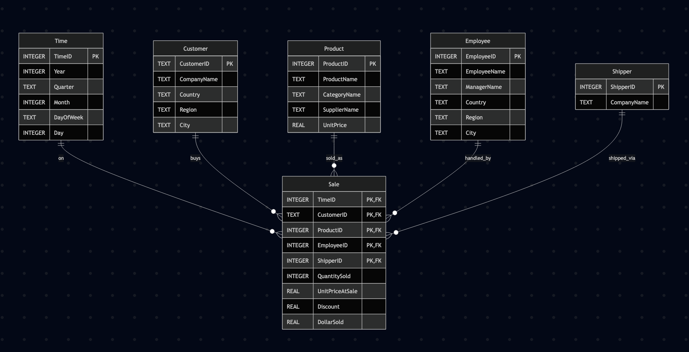

# 🗄️ Week 09
### Measure and hierarchy
[©](https://creativecommons.org/licenses/by/4.0) [Johnny Chan](mailto:jh.chan@auckland.ac.nz)


## 🕒 Previously ...

- ETL and ELT

- ELT and SQLite


## 📌 Agenda

- Measure and hierarchy

- OLAP operation: roll-up, drill-down, slice and dice, pivot


## 🪓 Setup

- Based on the [Northwind database](nw.sql), design and develop a data warehouse that tracks all the sale records per customer, product, employee and shipper over time

- Implement the Northwind data warehouse using SQLite


## Star schema
- The [star schema](nw-star.mmd) of the Northwind data warehouse in [mermaid.js](https://mermaid.js.org/syntax/entityRelationshipDiagram.html)



## EL
- Examine and execute the [nw-dw.sql](nw-dw.sql) script file to create nw-dw.db

  - Full-extract the *transformed data* required for dimension and fact tables into corresponding CSV files

  - Create all the required tables in a new SQLite database representing the Northwind data warehouse

  - Full-load the extracted data into the data warehouse SQLite database

Note: Purposefully this demonstrates a slightly different workflow comparing to ELT. The required tranformation logics are applied during data extraction, and so there is no need for further data transformation


## Measure
- A measure is a numerical value stored in a fact table. They could be analysed across multiple dimensions, e.g. total revenue by product and time

- To turn raw measure into meaningful insight we aggregate them using SQL multi-row functions like ```COUNT(), SUM(), AVG(), MIN(), MAX()``` and use ```GROUP BY``` with the dimension

- Stored vs derived measure: frequency, complexity, accuracy and space


## Constructing measure in Sale
- The following SELECT statement extracts transformed data from the Northwind database for constructing the measures / data columns of the Sale fact table

```
SELECT CAST(STRFTIME('%Y%m%d', OrderDate) AS INTEGER) TimeID,
    CustomerID,
    ProductID,
    EmployeeID,
    ShipVia ShipperID,

    Quantity QuantitySold,
    UnitPrice UnitPriceAtSale,
    IFNULL(Discount, 0.0) Discount,
    UnitPrice * Quantity * (1.0 - IFNULL(Discount, 0.0)) DollarSold

FROM OrderDetail od JOIN [Order] o
ON o.OrderID = od.OrderID
ORDER BY TimeID, CustomerID, ProductID, EmployeeID, ShipperID;
```
<!-- .element: style="font-size:85%" -->


## Example
- Aggregating a stored measure: total sales revenue per year; use the stored measure ```DollarSold```, fast query and no need to recompute each time
```
SELECT Year, ROUND(SUM(DollarSold), 2) TotalSale
FROM Sale s JOIN Time t ON s.TimeID = t.TimeID
GROUP BY Year
ORDER BY Year;
```
<!-- .element: style="font-size:85%" -->

- Calculating a derived measure: average selling price per product; derive on the fly from ```DollarSold / QuantitySold```
```
SELECT ProductName,
 ROUND(SUM(DollarSold) / SUM(QuantitySold), 2) AvgSellingPrice
FROM Sale s JOIN Product p ON s.ProductID = p.ProductID
GROUP BY ProductName
ORDER BY AvgSellingPrice DESC;
```
<!-- .element: style="font-size:85%" -->


## Example
- Combining stored and derived: price realisation vs catalog; compare the average selling price (derived from stored measure) to the catalog unit price

```
SELECT
  ProductName,
  ROUND(SUM(DollarSold) / SUM(QuantitySold), 2) AvgSellingPrice,
  ROUND(UnitPrice, 2) CatalogPrice,
  ROUND(SUM(DollarSold) / SUM(QuantitySold) - UnitPrice, 2)
    PriceVariance,
  ROUND(100.0 * SUM(DollarSold) / SUM(QuantitySold) / UnitPrice, 1)
    PriceRealisationPct
FROM Sale s JOIN Product p ON p.ProductID = s.ProductID
GROUP BY ProductName, UnitPrice
ORDER BY PriceRealisationPct DESC;
```
<!-- .element: style="font-size:85%" -->


## Example
- Combining stored and derived: effective discount rate by year; use stored measures to derive gross sale and the realised discount rate

```
SELECT Year,
  SUM(DollarSold) NetSale,
  SUM(UnitPriceAtSale * QuantitySold) GrossSale,
  ROUND((1 - SUM(DollarSold) /
    SUM(UnitPriceAtSale * QuantitySold)) * 100, 2) DiscountRate
FROM Time t JOIN Sale s ON t.TimeID = s.TimeID
GROUP BY Year;
```
<!-- .element: style="font-size:85%" -->
```
┌──────┬─────────────┬───────────┬──────────────┐
│ Year │   NetSale   │ GrossSale │ DiscountRate │
├──────┼─────────────┼───────────┼──────────────┤
│ 1996 │ 208083.97   │ 226298.5  │ 8.05         │
│ 1997 │ 617085.2035 │ 658388.75 │ 6.27         │
│ 1998 │ 440623.866  │ 469771.34 │ 6.2          │
└──────┴─────────────┴───────────┴──────────────┘
```
<!-- .element: style="font-size:85%" -->


## Hierarchy
- A hierarchy describes levels of granularity within a dimension, allowing user to drill-down or roll-up the data. Common examples include time (Year → Quarter → Month → Day), product (Category → Sub‑category → Product) and geography (Country → State → City)

- Hierarchies support two common OLAP operations:
  - Roll‑up: aggregate from lower level to higher level (e.g. Sale in Auckland → Sale in New Zealand)
  - Drill‑down: navigate from a higher level to a lower level (e.g. Sale in 2024 → Sale in January 2024)

- Hierarchies can be balanced (all branches have the same number of levels), unbalanced (some branches have more levels than others) or ragged (some levels may be skipped)
  - Further: [Hierarchies in dimensional modelling](https://www.ibm.com/docs/en/ida/9.1.2?topic=models-hierarchies)


## Constructing hierarchy in Time
- The following SELECT statement extracts transformed data from the Northwind database for constructing the hierarchy of the Time dimension table: Year → Quarter → Month → DayOfWeek → Day

```
SELECT DISTINCT
  CAST(STRFTIME('%Y%m%d', OrderDate) AS INTEGER) TimeID,
  CAST(STRFTIME('%Y', OrderDate) AS INTEGER) Year,
  'Q' || ((CAST(STRFTIME('%m', OrderDate)
    AS INTEGER) - 1) / 3 + 1) Quarter,
  CAST(STRFTIME('%m', OrderDate) AS INTEGER) Month,
  CASE STRFTIME('%w', OrderDate)
      WHEN '0' THEN 'Sunday'
      WHEN '1' THEN 'Monday'
      WHEN '2' THEN 'Tuesday'
      WHEN '3' THEN 'Wednesday'
      WHEN '4' THEN 'Thursday'
      WHEN '5' THEN 'Friday'
      WHEN '6' THEN 'Saturday'
  END DayOfWeek,
  CAST(STRFTIME('%d', OrderDate) AS INTEGER) Day
FROM [Order] ORDER BY TimeID;
```
<!-- .element: style="font-size:80%" -->
- 🤔 Is the hierarchy balanced, unbalanced or ragged?


## More hierarchy construction

```
SELECT DISTINCT CustomerID, CompanyName, Country, Region, City
FROM Customer
ORDER BY CustomerID;
```
<!-- .element: style="font-size:85%" -->

```
SELECT DISTINCT ProductID, ProductName, CategoryName,
  CompanyName SupplierName, UnitPrice
FROM Product p JOIN Category c ON p.CategoryID = c.CategoryID
JOIN Supplier s ON p.SupplierID  = s.SupplierID
ORDER BY ProductID;
```
<!-- .element: style="font-size:85%" -->

```
SELECT
    e.EmployeeID,
    e.FirstName || ' ' || e.LastName EmployeeName,
    CASE WHEN m.EmployeeID IS NOT NULL
      THEN m.FirstName || ' ' || m.LastName
      ELSE NULL
    END ManagerName,
    e.Country, e.Region, e.City
FROM Employee e LEFT JOIN Employee m ON e.ReportsTo = m.EmployeeID
ORDER BY e.EmployeeID;
```
<!-- .element: style="font-size:85%" -->

- 🤔 Are these hierarchies balanced, unbalanced or ragged?


## Roll-up
- Aggregating or summarising data from a lower level of detail to a higher level in a hierarhy, e.g. Quarter → Year

```
SELECT Year, Quarter,
  ROUND(SUM(DollarSold), 2) TotalSale
FROM Sale s JOIN Time t ON s.TimeID = t.TimeID
GROUP BY Year, Quarter ORDER BY Year, Quarter;
```
<!-- .element: style="font-size:85%" -->

```
┌──────┬─────────┬───────────┐
│ Year │ Quarter │ TotalSale │
├──────┼─────────┼───────────┤
│ 1996 │ Q3      │ 79728.57  │
│ 1996 │ Q4      │ 128355.4  │
│ 1997 │ Q1      │ 138288.92 │
│ 1997 │ Q2      │ 143177.05 │
│ 1997 │ Q3      │ 153937.77 │
│ 1997 │ Q4      │ 181681.46 │
│ 1998 │ Q1      │ 298491.55 │
│ 1998 │ Q2      │ 142132.31 │
└──────┴─────────┴───────────┘
```
<!-- .element: style="font-size:85%" -->


## Roll-up with SQL
- CTE, CASE, UNION ALL and sort key are used to implement the roll-up operation

```
WITH
YearQuarter AS (
  SELECT Year, Quarter,
    ROUND(SUM(DollarSold), 2) TotalSale,
    0 SortLevel, Year SortYear, Quarter SortQuarter
  FROM Sale s JOIN Time t ON t.TimeID = s.TimeID
  GROUP BY Year, Quarter
),
YearSubtotal AS (
  SELECT Year, NULL Quarter,
    ROUND(SUM(DollarSold), 2) TotalSale,
    1 SortLevel, Year SortYear, 'Q5' SortQuarter
  FROM Sale s JOIN Time t ON t.TimeID = s.TimeID
  GROUP BY Year
),
GrandTotal AS (
  SELECT NULL Year, NULL Quarter,
    ROUND(SUM(DollarSold), 2) TotalSale,
    2 SortLevel, 9999 SortYear, 'Q6' SortQuarter
  FROM Sale
)

SELECT
  CASE
    WHEN Year IS NULL THEN 'Grand Total'
    WHEN Quarter IS NULL THEN 'Subtotal'
    ELSE 'Detail'
  END RowType,
  Year, Quarter, TotalSale
FROM (
  SELECT * FROM YearQuarter
  UNION ALL
  SELECT * FROM YearSubtotal
  UNION ALL
  SELECT * FROM GrandTotal
)
ORDER BY SortYear, SortLevel, SortQuarter;
```
<!-- .element: style="font-size:85%" -->


## Roll-up result
```
┌─────────────┬──────┬─────────┬────────────┐
│   RowType   │ Year │ Quarter │ TotalSale  │
├─────────────┼──────┼─────────┼────────────┤
│ Detail      │ 1996 │ Q3      │ 79728.57   │
│ Detail      │ 1996 │ Q4      │ 128355.4   │
│ Subtotal    │ 1996 │         │ 208083.97  │
│ Detail      │ 1997 │ Q1      │ 138288.92  │
│ Detail      │ 1997 │ Q2      │ 143177.05  │
│ Detail      │ 1997 │ Q3      │ 153937.77  │
│ Detail      │ 1997 │ Q4      │ 181681.46  │
│ Subtotal    │ 1997 │         │ 617085.2   │
│ Detail      │ 1998 │ Q1      │ 298491.55  │
│ Detail      │ 1998 │ Q2      │ 142132.31  │
│ Subtotal    │ 1998 │         │ 440623.87  │
│ Grand Total │      │         │ 1265793.04 │
└─────────────┴──────┴─────────┴────────────┘
```
<!-- .element: style="font-size:85%" -->


## Homework
- Write a SQL statement to implement a roll-up operation for Month → Year with total sale


## Drill-down
- Navigating from a higher level to a lower level of detail in a hierarchy; it increases granularity which is opposite to roll-up

- Allowing analyst to identify root cause of trend seen at higher level; enables progressive exploration from summary to detail

```
┌──────┬────────────┐
│ Year │ TotalSale  │
├──────┼────────────┤
│ 1996 │ 208083.97  │
│ 1997 │ 617085.2   │
│ 1998 │ 440623.87  │
└──────┴────────────┘
```
<!-- .element: style="font-size:85%" -->

- Example workflow: 1) annual sale drop → 2) drill down to quarter → 3) drill down to month


## Drill-down with SQL
- Effectively drill-down operation is implemented by adding extra column(s)

```
--Annual sale
SELECT Year, ROUND(SUM(DollarSold), 2) TotalSale
FROM Sale s JOIN Time t ON s.TimeID = t.TimeID
GROUP BY Year ORDER BY Year;
```
<!-- .element: style="font-size:85%" -->

```
-- Drill-down: Year → Quarter → Month
SELECT Year, Quarter, Month,
  ROUND(SUM(DollarSold), 2) TotalSale
FROM Sale s JOIN Time t ON s.TimeID = t.TimeID
GROUP BY Year, Quarter, Month
ORDER BY Year, Quarter, Month;
```
<!-- .element: style="font-size:85%" -->


## Another example
```
-- Sale by country
SELECT Country, ROUND(SUM(DollarSold), 2) TotalSale
FROM Sale s JOIN Customer c ON s.CustomerID = c.CustomerID
GROUP BY Country
ORDER BY TotalSale DESC;
```
<!-- .element: style="font-size:85%" -->

```
-- Drill-down: Country → Region → City
SELECT Country, Region, City,
  ROUND(SUM(DollarSold), 2) TotalSale
FROM Sale s JOIN Customer c ON s.CustomerID = c.CustomerID
GROUP BY Country, Region, City
ORDER BY Country, TotalSale DESC;
```
<!-- .element: style="font-size:85%" -->


## Slice and dice
- OLAP structures data (i.e. fact) in a multi-dimensional [cube](https://en.wikipedia.org/wiki/OLAP_cube)

- Slice: fixing one value of a single dimension to produce a sub-cube

- Dice: selecting a subset of values from two or more dimensions to produce a smaller cube

- Both slice and dice are non-hierarchical operations; they are filters applied to explore pattern across specific subset of data without changing the granularity


## Slice and dice with SQL
- Slice and dice operations are implemented with the WHERE clause

```
-- Annual sale in USA (slice by country)
SELECT Year, Country,
  ROUND(SUM(DollarSold), 2) TotalSale
FROM Sale s JOIN Time t ON s.TimeID = t.TimeID
JOIN Customer c ON s.CustomerID = c.CustomerID
WHERE Country = 'USA'
GROUP BY Year, Country
ORDER BY Year, Country;
```
<!-- .element: style="font-size:85%" -->

```
-- 1997 sale for beverages in USA and Canada
SELECT Year, Country, CategoryName,
       ROUND(SUM(DollarSold), 2) TotalSale
FROM Sale s JOIN Time t ON s.TimeID = t.TimeID
JOIN Customer c ON s.CustomerID = c.CustomerID
JOIN Product p ON s.ProductID = p.ProductID
WHERE Year = 1997
AND Country IN ('USA', 'Canada')
AND CategoryName = 'Beverages'
GROUP BY Year, Country, CategoryName
ORDER BY TotalSale DESC;
```
<!-- .element: style="font-size:85%" -->


## Pivot
- A technique to reshape the data or re-orient the OLAP cube (i.e. rows become columns and vice versa)

- Often used in report and dashboard

```
-- Pivot on year for each country
SELECT Country,
  ROUND(SUM(CASE WHEN Year = 1996
    THEN DollarSold ELSE 0 END), 2) '1996',
  ROUND(SUM(CASE WHEN Year = 1997
    THEN DollarSold ELSE 0 END), 2) '1997',
  ROUND(SUM(CASE WHEN Year = 1998
    THEN DollarSold ELSE 0 END), 2) '1998'
FROM Sale s JOIN Customer c ON s.CustomerID = c.CustomerID
JOIN Time t ON s.TimeID = t.TimeID
GROUP BY Country ORDER BY Country;
```
<!-- .element: style="font-size:85%" -->


## Another example
```
-- Pivot category by country
SELECT CategoryName,
  ROUND(SUM(CASE WHEN Country = 'USA'
    THEN DollarSold ELSE 0 END), 2) USA,
  ROUND(SUM(CASE WHEN Country = 'Canada'
    THEN DollarSold ELSE 0 END), 2) Canada,
  ROUND(SUM(CASE WHEN Country = 'Mexico'
    THEN DollarSold ELSE 0 END), 2) AS Mexico,
  ROUND(SUM(CASE WHEN Country = 'Argentina'
    THEN DollarSold ELSE 0 END), 2) AS Argentina,
  ROUND(SUM(CASE WHEN Country = 'Brazil'
    THEN DollarSold ELSE 0 END), 2) AS Brazil,
  ROUND(SUM(CASE WHEN Country = 'Venezuela'
    THEN DollarSold ELSE 0 END), 2) AS Venezuela
FROM Sale s JOIN Product p  ON s.ProductID = p.ProductID
JOIN Customer c ON s.CustomerID = c.CustomerID
GROUP BY CategoryName ORDER BY CategoryName;
```
<!-- .element: style="font-size:85%" -->


## 🗒 Summary
- By now you have learnt:

	- what measure and hierarchy are in the context of data warehouse
	- how to perform roll-up, drill-down, slice and dice, and pivot in SQL


## 📝 To do
- Practice converting analytical question into SQL statement
- Attend the lab
- Continue to work on your project


## 📚 Reading
- No reading!


## 🗓 Schedule
Week | Lecture
--- | ---
01 | Introduction ✓
02 | SQL fundamentals ✓
03 | Data modelling ✓
04 | SQL aggregation & subquery ✓
05 | Recap ✓
06 | Test review ✓
07 | Data warehouse ✓
08 | Extract, transform & load ✓
09 | Measure & hierarchy ✓
10 | Course review


# 🌏 THE END
Don't forget information management is awesome!

[🖨](?print-pdf)
